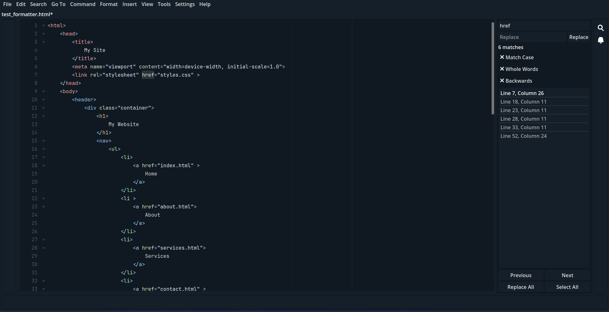

# Text Forge - Simplicity to start, power to grow!
Extensible and modular code editor with Godot 4.4

---

Text Forge is a lightweight, extensible, and mode-driven text editor. It's customizable, scriptable, and ready to handle
any format and language. There is a data-driven and object-oriented environment for create customized code editors without any
change in source.

Text Forge is an editor with **highly structured** core, there is a lot of ways to enhance your environment as a 
programmer! Just plug what you want and see how it will expand everything as you want, with this modular framework you
have a complete workspace that is as fast as possible!

 ^ Simple screenshot from Text Forge in `HTML` mode with *Find & Replace* panel (This screenshot is a demo of special auto formatter, html file in image was generated automatically by text forge auto format [from this input](https://github.com/user-attachments/assets/4e3dda16-7167-428e-aae3-47cd4bd19f86))

> [!Note]
> This project currently is in development state, feel free to contribute in any way you like. Text Forge is an 
> open-source project, so you can use it **for free**,  **forever**, **for anything**, just share what you think about 
> Text Forge with us!

---

## ✨ Core Principles

- **lightweight design**
- **extensibility**
- **mode-drive design**
- **be customizable**
- **scriptable design**
- **language agnostic design**
- **data-driven interface**
- **object-oriented design**
- **plug-and-play extension architecture**

---

## Why Text Forge?

Text Forge is a response to the growing demand for tools that **empower** rather than constrain. Designed as a 
standalone text editor with a focus on **modularity, deep customization, and minimal design**, it offers a flexible and 
efficient foundation for users who want full control over their editing environment.

With Text Forge:
- The internal architecture is structured to make components easy to add, remove, or redefine
- A versatile formatting engine enables precise handling of complex, structured text
- It delivers a lightweight, independent experience—usable without dependency on heavy ecosystems
- **It provides a core foundation that can be rapidly adapted to various file types, formatting styles, and workflows**—in essence, Text Forge is more than an app; it functions as a *framework for building custom editors*

Our goal is to create a tool that puts creative and technical decisions back in the hands of the user—where they belong.

---

## 🚀 Installing

Please see [Setup page in Text Forge Online Docs](https://text-forge.github.io/docs/setup/) for installation guide.

---

## 🧰 Modes

Modes are special modules that allow Text Forge to support a variety of files and languages along with custom buffer and
formats and highlights, Text Forge does not support any specific formats without modes (only UTF-8 is available without
mode), you can find or make your mood for any usage. You can see [here](https://github.com/text-forge/mode-library) for 
available modes. You can read more about modes [here](https://text-forge.github.io/docs/modes).

---

## 📜 Documentation

You can see [text-forge.github.io/docs](https://text-forge.github.io/docs) for official online documentation. Text Forge
documentation source is available in `docs/`folder in this repository.

---

## 🤍 Contributing

Text Forge designed to be community-driven, so you can help this community in any way you can think! Please go to [Contributing Guide Page](https://text-forge.github.io/docs/conributing) to get more information.
Also, you can make modes, action scripts, themes, packages, etc. to improve and customize Text Forge without touch the core.

---

## 🔐 License & Credit

MIT 2025 Mahan Khalili and contributors. See more information in LICENSE file.

Core concept crafted by Mahan Khalili, with an eye toward modularity, control, and clarity.
